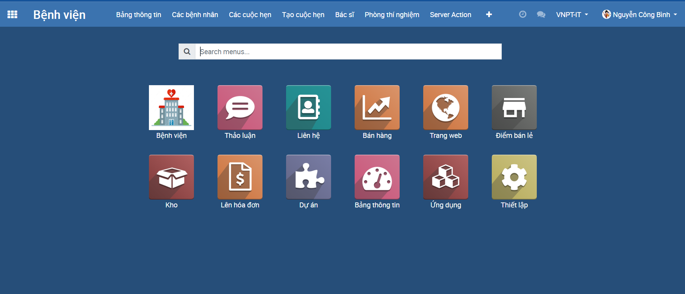

# Tạo dự án quản lý bệnh viện (Mô phỏng)
**1. Mô tả**
- Xây dựng ứng dụng Web quản lý bệnh viện với các chức năng chính sau:
    + Phân quyền tài khoản
    + Quản lý bệnh nhân, bác sĩ
    + Đặt lịch khám, chữa bệnh
    + ...
- Mục tiêu: 
    + Làm quen với framework Odoo 12
    + Xây dựng ứng dụng với các chức năng cơ bản của 1 phần mềm ERP
- Công nghệ sử dụng:
    + Odoo 12
    + PyCharm IDE
    + PostgreSQL 12

**2. Giao diện chính**
<h4 align="center">Giao diện chính</h4>

<h4 align="center">...</h4>